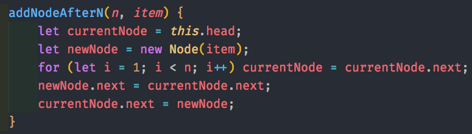

### Singly Linked List - Singly Linked Lists have only one pointer (next)

Node and LinkedList Classes

Function to add a single node at the end

Function to add array of nodes at the end

Function to get element at N position

Function to return all elements in list as a string

Function add a node after N elements

Function to remove an item from list

Function to remove element at position N

Function to remove M nodes from position N

Function to reverse linked list

Function to swap two nodes

Function to get the length of linked list

Function to check if list is empty

Function to implement a function on every node

Passing a function to multiply by 10 into implementFunc()

